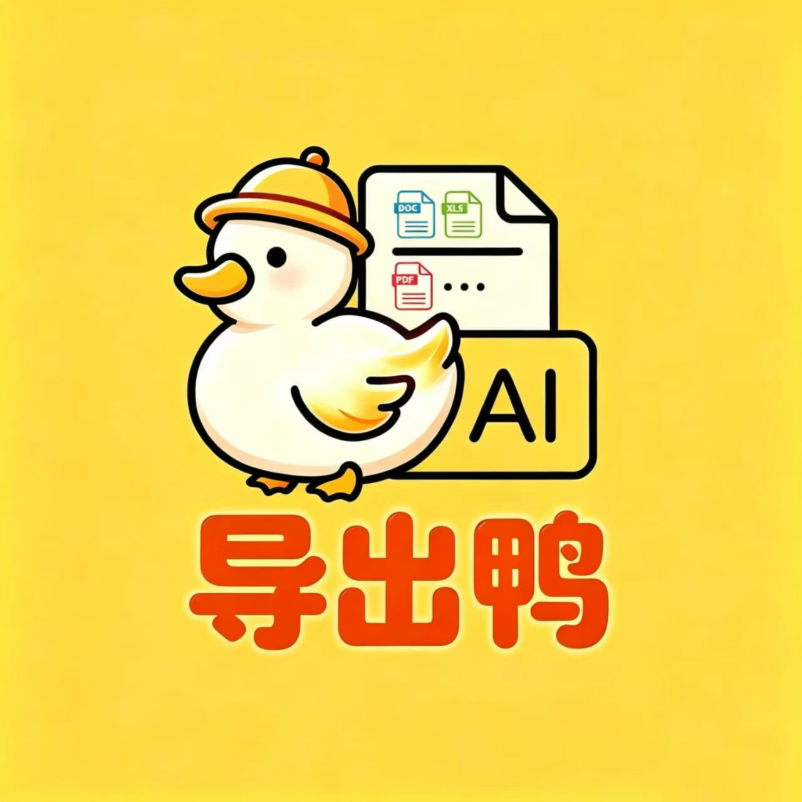

# AI导出鸭

**专业的 AI 内容格式转换工具**

[官方网站](https://daochuya.com) · [浏览器扩展下载](https://daochuya.com/download/aidcy-plugin.crx) · [使用文档](#功能特性)

---

## ✨ 产品简介

AI导出鸭是一款专业的 AI 内容格式转换工具，支持一键导出 AI 对话内容到多种常用格式。完美保留思维链推理、LaTeX 公式、代码高亮、图片嵌入，让你的 AI 对话可留、可改、可继续推进。

## 🤖 支持的 AI 平台

**17+ 主流 AI 平台，覆盖国内外主流大模型**

| 国内平台 | 国际平台 |
|:--------:|:--------:|
| DeepSeek | ChatGPT |
| 豆包 | Gemini |
| 通义千问 | Claude |
| 文心一言 | Grok |
| 腾讯元宝 | Copilot |
| 智谱清言 | Perplexity |
| Kimi | Poe |
| MiniMax | AI Studio |
| Mistral | - |

## 📦 支持的导出格式

| 文档格式 | 网页格式 | 数据格式 | 图片格式 |
|:--------:|:--------:|:--------:|:--------:|
| Word (.docx) | HTML | JSON | PNG (长图) |
| PDF | Markdown | CSV | - |
| TXT | - | - | - |

## 🎯 核心功能

### 1. 一键导出
- 整段会话完整归档
- 单条消息单独导出
- 思维链、公式、代码、图片完美保留

### 2. 多格式支持
- **Word/PDF**: 结构、代码、公式、图片导出后原样落纸
- **Markdown/HTML**: 层级与链接完整保留，适合知识库和代码仓库
- **JSON/CSV**: 字段与元数据结构化输出，可直接导入表格或归档系统
- **PNG**: 按消息粒度导出图片，省去截图、裁剪、拼接

### 3. 知识管理
- **Seed 种子库**: 保存常用提问模板，一键掷回输入框
- **Crop 剪藏**: 重要回答剪藏留档，带上下文保留
- **谷仓**: 完整会话由收割机后收集，统一管理

### 4. AI Hub
- 侧边栏直接调取 15 个 AI 平台
- 无需频繁切换标签页
- 历史记录与已保存内容一键查看

## 🔧 安装使用

### 浏览器扩展

支持以下浏览器：

- ✅ Microsoft Edge
- ✅ Google Chrome
- ✅ Firefox
- ✅ 360 浏览器
- ✅ QQ 浏览器
- ✅ 搜狗浏览器
- ✅ UC 浏览器
- ✅ 夸克浏览器
- ✅ 豆包浏览器
- ✅ 2345 浏览器

#### 安装步骤

1. 下载 CRX 安装包：[aidcy-plugin.crx](https://daochuya.com/download/aidcy-plugin.crx)
2. 打开浏览器扩展管理页面
3. 开启开发者模式
4. 拖入 CRX 文件完成安装

## 🔒 隐私与条款

- [隐私政策](https://daochuya.com/privacy)
- [服务条款](https://daochuya.com/terms)

## 📊 对比优势

| 功能 | AI导出鸭 | 手动复制 | 截图保存 | 普通扩展 |
|:-----|:--------:|:--------:|:--------:|:--------:|
| 推理与隐藏内容保留 | ✅ | ❌ | ❌ | ❌ |
| LaTeX 公式可读 | ✅ | ❌ | △ | △ |
| 代码块保持清晰 | ✅ | ❌ | △ | △ |
| Word 导出后可编辑 | ✅ | ❌ | ❌ | △ |
| 图片原位保留 | ✅ | ❌ | ✅ | △ |
| 知识沉淀与隐藏 | ✅ | ❌ | ❌ | ❌ |
| Google Docs/Drive 对接 | ✅ | ❌ | ❌ | △ |

> ✅ 原生支持  △ 部分支持  ❌ 不支持

## 💡 使用场景

- **整段留档**: 完整聊天导出为 Word、PDF、HTML 或 Markdown
- **重点单取**: 只留最关键的一条回答或代码
- **直接复用**: 富文本、Markdown、纯文本按需复制
- **本地沉淀**: 剪藏高价值回答，本地留存随时检索
- **跨平台推进**: 把回答嫁接到其他 AI 继续追问
- **在线协作**: Google Docs 直送，跨设备同步

---

**保存是起点，积累才是终点**

[开始使用](https://daochuya.com) · [联系我们](https://daochuya.com)

